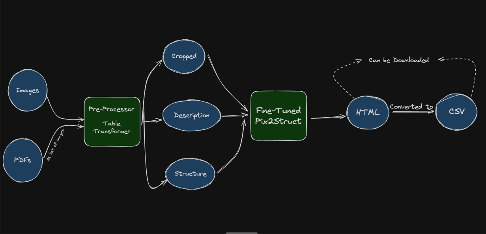
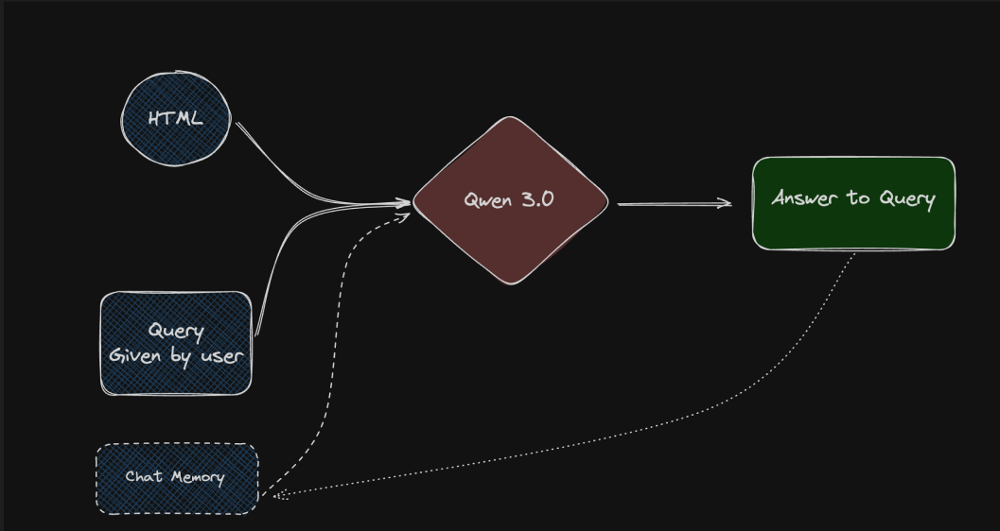

# Tabularis: Table Understanding and Chatbot Query System

Tabularis is a pipeline that extracts tables from **PDFs or images** and converts them into **HTML and CSV** formats using a fine-tuned [Pix2Struct model](https://huggingface.co/docs/transformers/model_doc/pix2struct). These tables are then used by a chatbot powered by [Qwen 3.0](https://www.kaggle.com/models/qwen-lm/qwen-3/transformers/0.6b), which can answer user queries based on the extracted table content.


---

### 📊 Table Extraction Architecture



1. **PDFs or Images** are passed into a Table Transformer-based Preprocessor.
2. It generates cropped table regions, descriptions, and structural metadata.
3. These are processed by a fine-tuned **Pix2Struct** model to generate an **HTML** table.
4. The output is converted to **CSV** and made downloadable.

---

### 🤖 Query Answering via Chatbot



1. The generated **HTML table**, along with the **user's query**, is passed to the **Qwen 3.0** LLM.
2. The chatbot uses chat memory to retain context.
3. The model then responds with a relevant **answer** based on the table content.


## 📦 Installation

1. Clone the repo:
   ```bash
   git clone https://github.com/bharat-agrawal-05/DL-hackathon/
   cd DL-Hackathon
   ```

2. Create a virtual environment (optional):
   ```bash
   python3 -m venv venv
   myenv\Scripts\activate
   ```
   Or in macOS:
   ```bash
   python3 -m venv venv
   source venv/bin/activate
   ```

3. Install the required libraries
   ```bash
   pip install -r requirements.txt
   ```


## 🚀 Running the Project

### 1. Downloading the qwen-3 model

Before using Tabularis’s model, download the qwen-3 weights from Kaggle.
   ``` bash
    curl -L -o ~/Downloads/model.tar.gz \
    https://www.kaggle.com/api/v1/models/qwen-lm/qwen-3/transformers/0.6b/1/download
   ```

Extract the model.tar.gz file into the directory DL-Hackathon.

Also download the `pix2struct Fine Tuned Model` from - `https://drive.google.com/file/d/1zySWPpCoXck8CmEbOMspMWpTtmmT6U8p/view?usp=sharing`
And place it inside `vlmax/` folder

After running the download script and extracting `model.tar.gz`, your directory should look like this:

```bash
DL-hackathon/
│
├── app.py
├── FinalFineTuningPix2Struct.ipynb
├── README.md
├── requirements.txt
│
├── qwen-3-transformers-0.6b-v1/        
│
├── vlmax/                              
│   ├── .next/
│   ├── app/
│   ├── node_modules/
│   ├── pix2struct-base-table2html/
│   ├── public/
│   ├── python/
│   ├── ReactBits/
│   ├── .gitignore
│   ├── eslint.config.mjs
│   ├── jsconfig.json
│   ├── next.config.mjs
│   ├── package-lock.json
│   ├── package.json
│   ├── postcss.config.mjs
│   └── README.md
```


### 2. Start the Backend

Navigate into the Python backend directory (where `app.py` lives) and launch it on port 4000:

   ```bash
    export PORT=4000         # ensure the app picks up port 4000
    python app.py
   ```

### 3. Start the Frontend

From the vlmax directory (your frontend folder), install dependencies and fire up the dev server:

   ```bash
    cd vlmax
    npm i          
    npm run dev        
   ```

